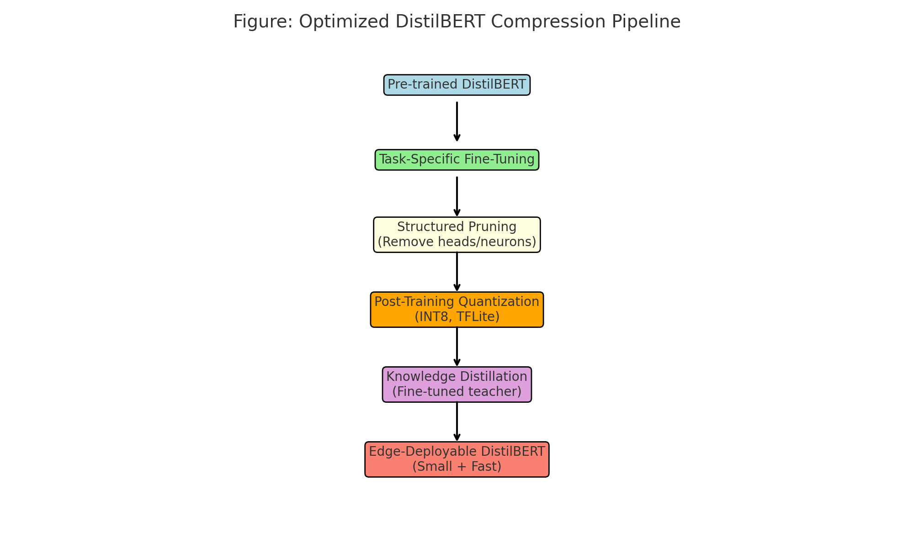

# DistilBERT-Optim

* The proposed framework employs a structured combination of pruning, quantization, and knowledge distillation to significantly reduce model size and computational load, with minimal impact on accuracy. Our optimized DistilBERT attains around 90% accuracy on the SST-2 sentiment dataset, maintaining performance close to the original DistilBERT (91-92%), while significantly decreasing model size by approximately eightfold and improving inference speed by 2–3 times. Through rigorous comparisons with existing compact models such as TinyBERT and MobileBERT, our results highlight superior performance-to-efficiency ratios.

<br />


* This code is modified based on the repository developed by Hugging Face: [Transformers v2.1.1](https://github.com/huggingface/transformers/tree/v2.1.1)
* The results in the paper are produced by using single V100 GPU.

## Environment and data

- Prepare environment.
```bash
pip install -r requirements.txt
```

- Prepare the data sets.
The **original** SST-2 dataset, part of the GLUE benchmark, can be accessed from [here]([https://gluebenchmark.com/tasks](https://huggingface.co/datasets/gimmaru/glue-sst2)).
The SST-2 dataset, is used for binary sentiment classification (positive or negative). We load it using the Hugging Face datasets library and tokenize the sentences using the DistilBERT tokenizer.
Dataset Loading: The dataset is loaded with `load_dataset("glue", "sst2")`, which provides train, validation, and test splits.
Tokenization: Sentences are tokenized with padding and truncation to a maximum length of 128 tokens.
Data Conversion: The tokenized dataset is converted to tf.data.Dataset format for TensorFlow compatibility, with a batch size of 16.


## Fine-Tuning DistilBERT

**Step 1.** 
Fine-tune the pretrained [BERT base model](https://huggingface.co/bert-base-uncased).


**Step 2.** Fixed Pruning Implementation
Use TensorFlow Model Optimization Toolkit for 50% sparsity.

**Step 3.** Quantization
Apply post-training quantization with TensorFlow Lite.

**Step 4.**  Knowledge Distillation
Fine-tune the pruned model using the original DistilBERT as the teacher.


## Reference
Vibhuti V Sawant, & S. K. Gaikwad. (2025). Hardware-Aware Optimization of Transformer Models for Edge AI: Pruning, Quantization, and Distillation Unified. 
https://doi.org/10.5281/zenodo.15781618
```
@misc{vibhuti_v_sawant_2025_15781618,
  author       = {Vibhuti V Sawant and
                  S. K. Gaikwad},
  title        = {Hardware-Aware Optimization of Transformer Models
                   for Edge AI: Pruning, Quantization, and
                   Distillation Unified
                  },
  year         = 2025,
  publisher    = {Zenodo},
  doi          = {10.5281/zenodo.15781618},
  url          = {https://doi.org/10.5281/zenodo.15781618},
}
```
